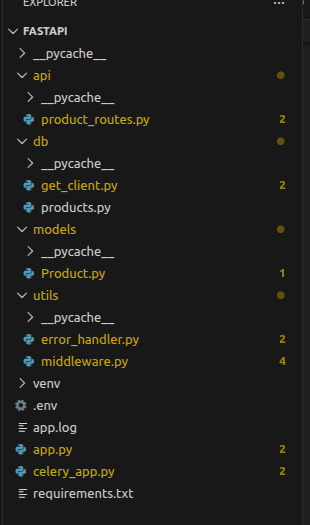
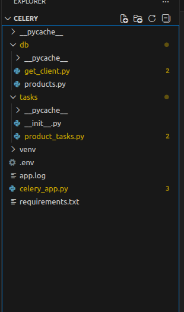

# Simprosys API Task

## Installation

Clone the repo and install dependencies:

```bash
git clone https://github.com/yourusername/project-name.git
```
Terminal-1 
```bash
cd fastapi
pip install -r requirements.txt
```
Terminal-2
```bash
cd fastapi
pip install -r requirements.txt
```


## Usage

Run the fastapi app:

```bash
uvicorn app:app --reload --log-level debug
```

Run the Celery app:

```bash
celery -A celery_app.app worker --loglevel=INFO
```

## Folder Structure

Fastapi App




Celery App





## Environment Variables

### Fastapi Env
```bash
MONGO_URL
REDIS_BACKEND_URL
REDIS_BROKER_URL
```
### Celery Env
```bash
MONGO_URL
REDIS_BACKEND_URL
REDIS_BROKER_URL
```


## Sample Curl Requests 


### 1. POST    /products/batch

Request :

``` bash
curl -X 'POST' \
  'http://127.0.0.1:8000/products/batch' \
  -H 'accept: application/json' \
  -H 'Content-Type: application/json' \
  -d '[
  {
    "product_id": 1,
    "product_name": "Wireless Mouse",
    "sku": "WM-001",
    "product_image": "https://example.com/mouse",
    "price": 799,
    "description": "Ergonomic wireless mouse"
  }]'
```
Response:
```json
{
  "msg": "Insert products task started with id 79ab9ddb-e175-4eba-ab5b-2e54d35583fa"
}
```


### 2. GET    /products/batch/{task_id}

Request :

``` bash
curl -X 'GET' \
  'http://localhost:8000/products/batch/{task_id}' \
  -H 'accept: application/json'
```
Response:
```json
{
  "task_id": "56202acb-4e30-460b-bd68-cf2f46451fec",
  "status": "completed",
  "result": {
    "Total Products Inserted": 0,
    "Errors in Inserting ": [
      "E11000 duplicate key error collection: simprosys-api.products index: Unique ID dup key: { id: 1 }, full error: {'index': 0, 'code': 11000, 'errmsg': 'E11000 duplicate key error collection: simprosys-api.products index: Unique ID dup key: { id: 1 }', 'keyPattern': {'id': 1}, 'keyValue': {'id': 1}}"
    ],
    "Inserted Product IDs": [],
    "Rejected Product IDs: ": [
      1
    ]
  }
}
```

### 3. GET    /products

Request :

``` bash
curl -X 'GET' \
  'http://localhost:8000/products/' \
  -H 'accept: application/json'
```
Response:
```json
{
  "products": [
    {
      "id": 1,
      "title": "Product-1",
      "description": "Product DESC - 1",
      "image": "image_url",
      "url": "url",
      "sku": "sbjkdbajbcajk",
      "colour": "brown",
      "size": "S",
      "createdAt": "2020-05-18T14:10:30.123Z"
    },
    {
      "id": 2,
      "title": "string",
      "description": "string",
      "image": null,
      "url": null,
      "sku": "string",
      "colour": "stringstringstringstringstringstringstringstringst",
      "size": "strin",
      "createdAt": "2026-04-24T14:08:19.371000"
    }
  ]
}
```
### 4. GET    /products/{product_id}

Request :

``` bash
curl -X 'GET' \
  'http://localhost:8000/products/{product_id}' \
  -H 'accept: application/json'
```
Response:
```json
{
  "products": {
    "id": 3,
    "title": "string",
    "description": "string",
    "image": null,
    "url": null,
    "sku": "string1",
    "colour": "stringstringstringstringstringstringstringstringst",
    "size": "strin",
    "createdAt": "2026-04-24T14:08:19.371000"
  }
}
```

